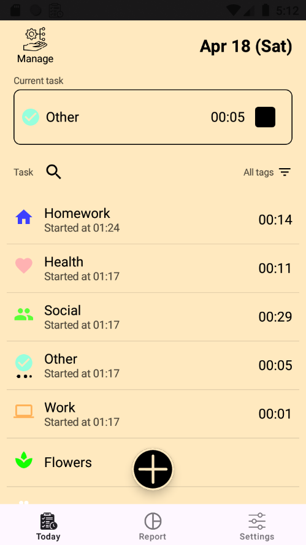
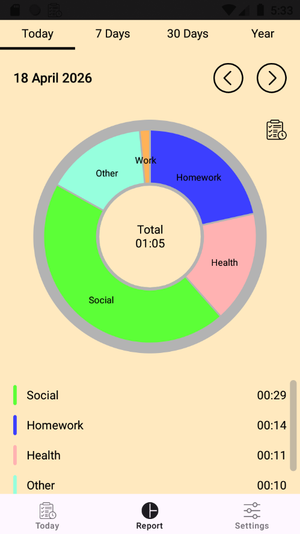
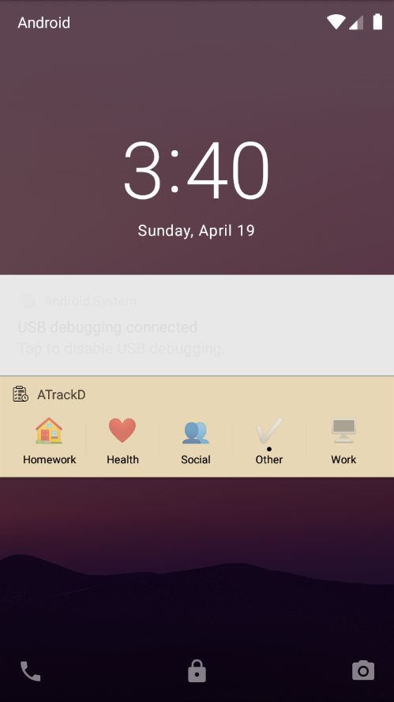

# ATrackD

  <b>Простой и удобный трекер времени, который позволяет наглядно оценивать картину повседневных активностей.</b>

  
  
  

---

## 🎯 О проекте
**ATrackD** - это бесплатный аналог приложений такого типа, которых уже немало имеется на маркет-плейсах. Такие приложения созданы для тех, кто хочет отслеживать то, чем занимается за день, кому важно подобрать структуру дня и, возможно, всей жизни. И если данное приложение поможет вам в этом, я буду очень рад!

## 🚀 Быстрый старт
1. создайте активности
2. сгруппируйте их по тэгам
3. добавьте некоторые из активностей в панель уведомлений для включения или любого места, включая состояние блокировки
4. включайте и выключайте таймеры активностей
5. в конце дня, недели, месяца, года анализируйте затраченное время на активности и их категории на специальном круговом графике

## ✨ Основные возможности
- Учёт времени по активностям
- Группировка через теги
- Отчёты по дням / неделям / месяцам
- Быстрый доступ через панель уведомлений
- Настройка внешнего вида

## 📚 Документация
Подробная инструкция по использованию приложения:  
[Открыть руководство пользователя](docs/USER_GUIDE.md)

### 📦 7. Установка
1. Скачайте APK-файл:
[Скачать APK](https://github.com/tinglevik/ATrackD_Android/releases/latest/app-release.apk)
2. Откройте файл на устройстве
3. При необходимости разрешите установку из неизвестных источников
4. Подтвердите установку
---

## 🛠 Технический стек
*   **Language:** Kotlin
*   **UI Framework:** Jetpack Compose
*   **Database:** Room
*   **Architecture:** MVVM / Clean Architecture
*   **DI:** Koin
