# actitracker — Руководство пользователя

### 🚀 1. Создайте список активностей
Чтобы создать активность, нажмите на кнопку "+" 

| на экране "Сегодня" внизу | или | на экране "Управление" справа вверху |
| :---: | :---: | :---: |
|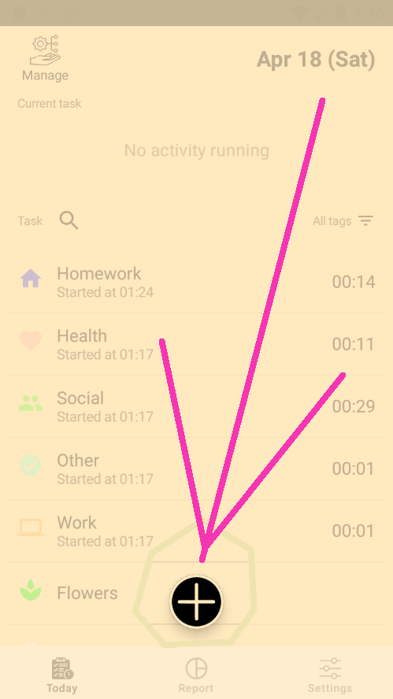 | | 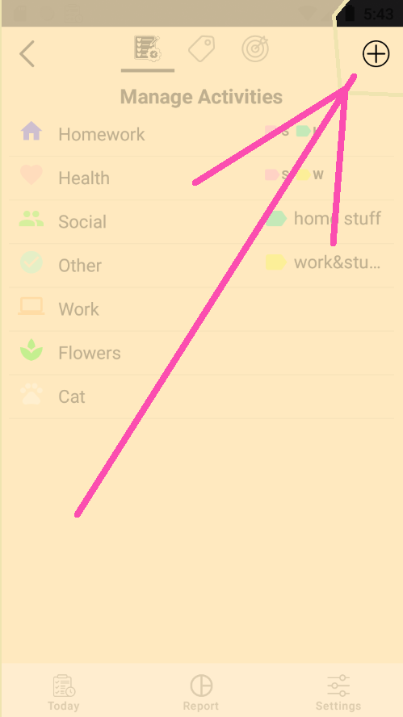 |

В появившемся окне 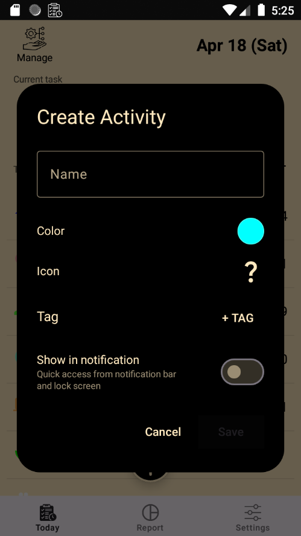 вы можете настроить:

| цвет активности | иконку для нее | присвоить ей тег (см. п.2) |
|:---: | :---: | :---: |
|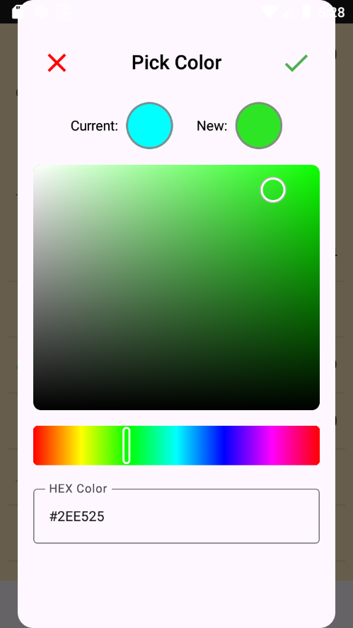 | 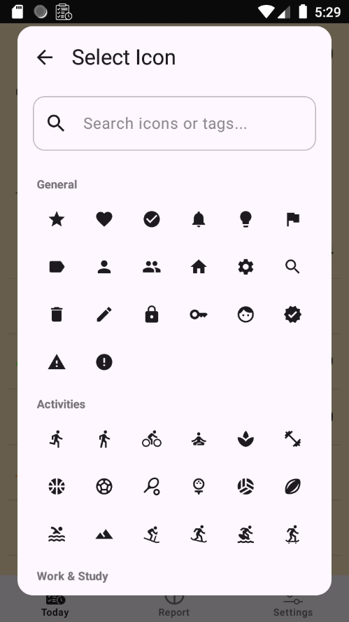 | 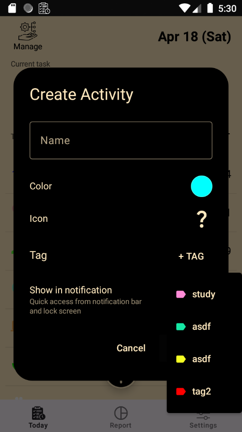 |

После чего вы можете запускать и останавливать активности, нажимая на них на экране "Сегодня", а также в панелях уведомлений в разблокированном и заблокированном состояниях устройства (как добавлять активности в панели уведомлений см. ниже в пункте 5), при этом активности будут выглядеть так:

|Не запущена | Активный трекинг |
|:---: | :---: |
|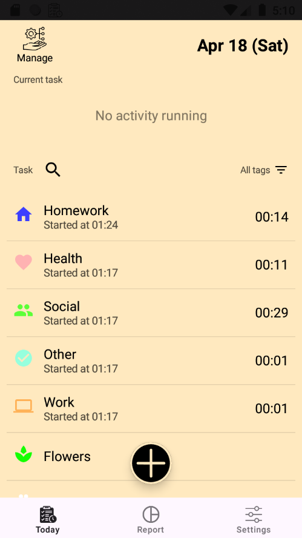 |  |

На картинке справа вы можете видеть, что на экране "Сегодня" включенная активность отображается также в специальной строке, где ее тоже можно остановить.

### 🏷️ 2. Создайте теги (категории)
Активности можно группировать по категориям с помощью тегов. Для создания и настройки тегов перейдите с экрана "Сегодня" в раздел Manage, тапнув по соответствующей иконке слева вверху экрана  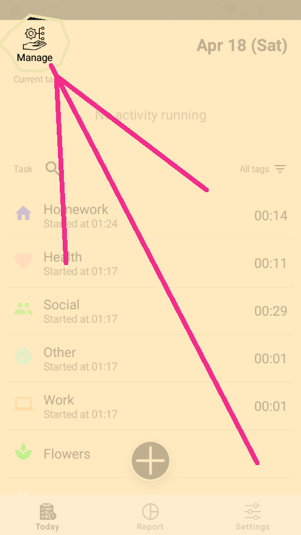, а затем на экране Manage перейдите во вкладку "Теги":

| Список тегов | Настройки тега |
|:---: | :---: |
| 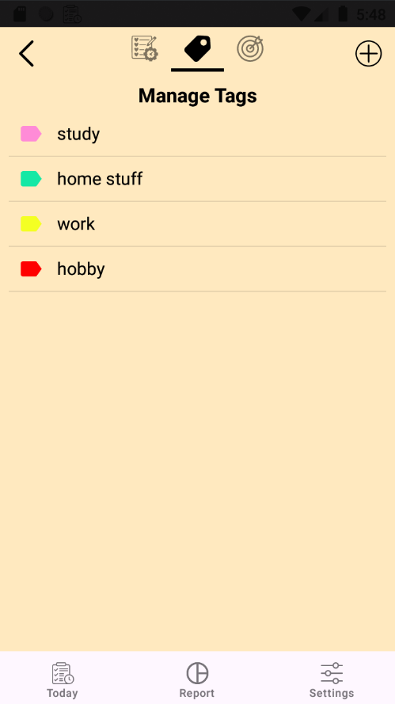 |  |

Кнопка "+" на этой вкладке справа вверху отвечат за создание тега (аналогично созданию активности на соответствующей вкладке). Нажмите на тег в списке тегов (картинка слева), чтобы настроить его (картинка справа). 

### 📊 3. Просматривайте наглядные отчеты
Перейдите на экран Отчет по иконке в нижней панели. Здесь круговой график (пирог) покажет общую картину ваших активностей за сутки, неделю, месяц или год. Вы можете анализировать свою продуктивность в разрезе активностей и тегов, переключая режим этого графика иконкой в правом верхнем углу от него. А стрелки выше над этой иконкой переключают сутки, за которые формируется отчет.

|Отчет по активностям | Отчет по тегам |
|:---: | :---: |
|  | 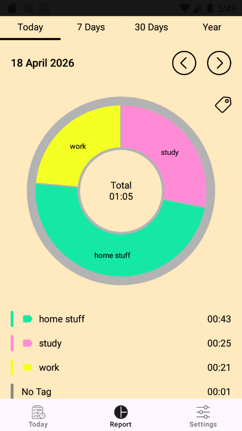 |

### ⚡ 4. Настройте быстрый доступ (Quick Panel)
Вы можете управлять трекингом прямо из панели уведомлений. Для этого добавляйте и удаляйте активности для быстрого запуска, чтобы переключать активности без необходимости открывать приложение или разблокировать устройство. Сделать это можно долгим нажатием на активность на экране "Сегодня" или переключением соответствующей кнопки в окне настройки активностей с экрана "Управление" (см. п.1):

|длинное нажатие на экране "Сегодня" | из окна "Управление" |
|:---: | :---: |
|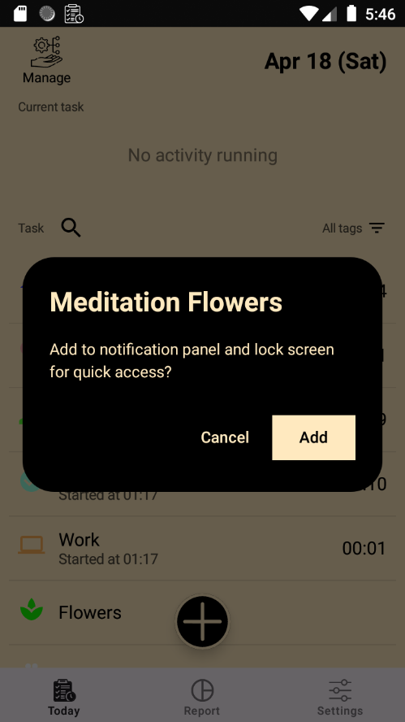 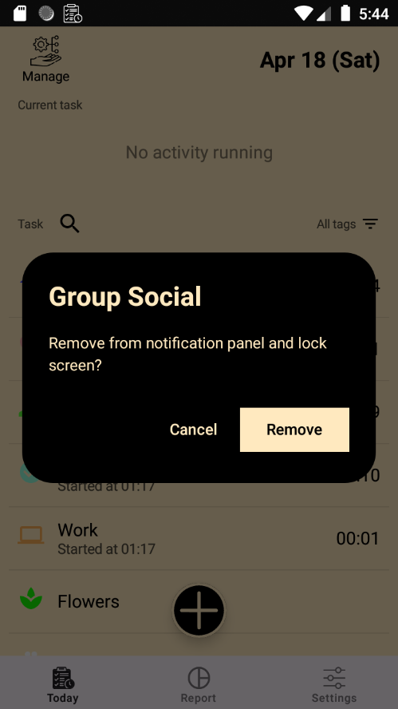 | 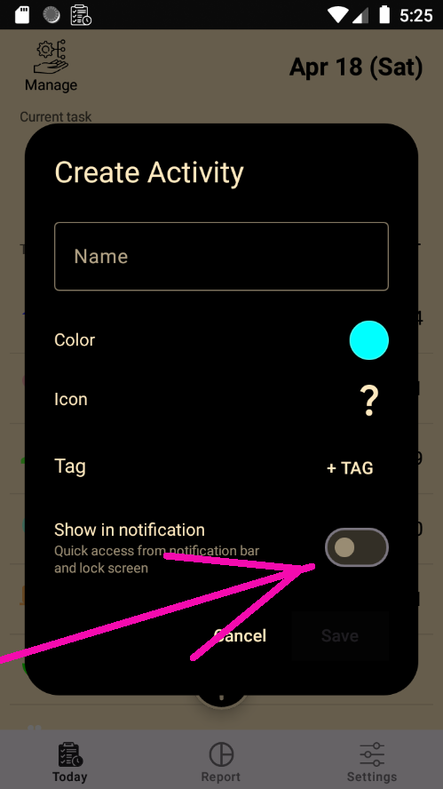 |

Активности в панелях уведомлений будут выглядеть так:

|длинное нажатие на экране "Сегодня" | из окна "Управление" |
|:---: | :---: |
|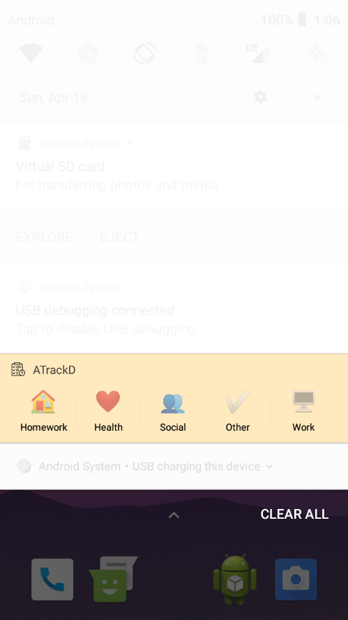 |  |

### 🎨 5. Настройки приложения
Вы можете изменить цвета интерфейса, текста, иконок на свое усмотрение. 

| Общие настройки | Настройка цвета |
|:---: | :---: |
|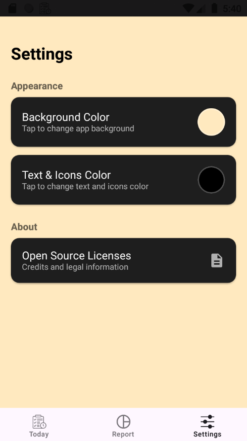 | 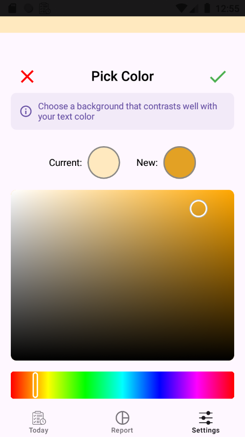 |

Примечание:
если вдруг вы случайно выберете такие цвета фона и текста, что текст и элементы будут нечитаемы (или трудночитаемы), приложение откатит такие изменения через 30 секунд, если вы явно не согласитесь оставить такие настройки в предупреждении, которое появится справа:

| Предупреждение свернуто | Предупреждение развернуто |
|:---: | :---: |
|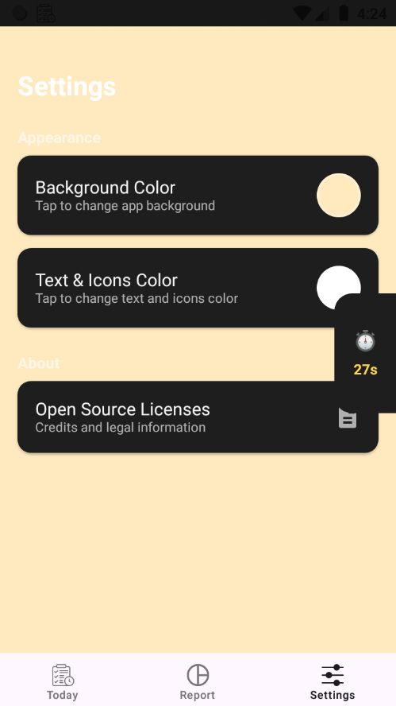 | 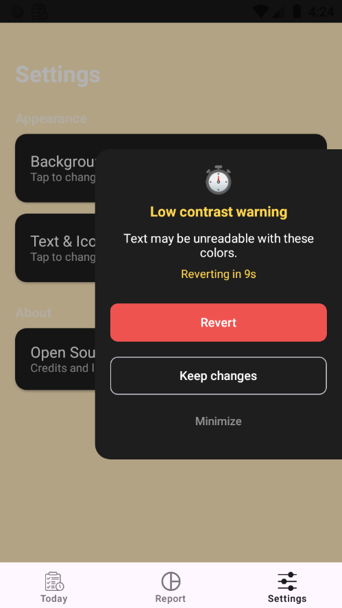 |

Ожидаются также настройки импорта/экспорта активностей, фонов, своих иконок, настройки режима отображения времени и дат, языков.

### 🏆 6. Цели и прогресс
Функционал этого окна ожидается в будущих обновлениях.